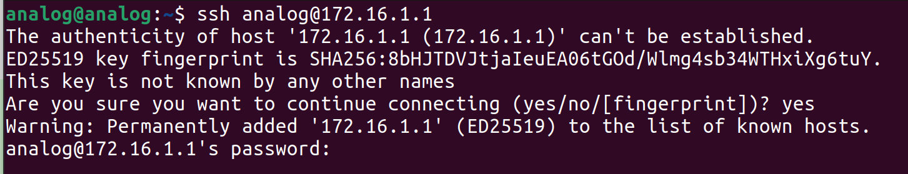
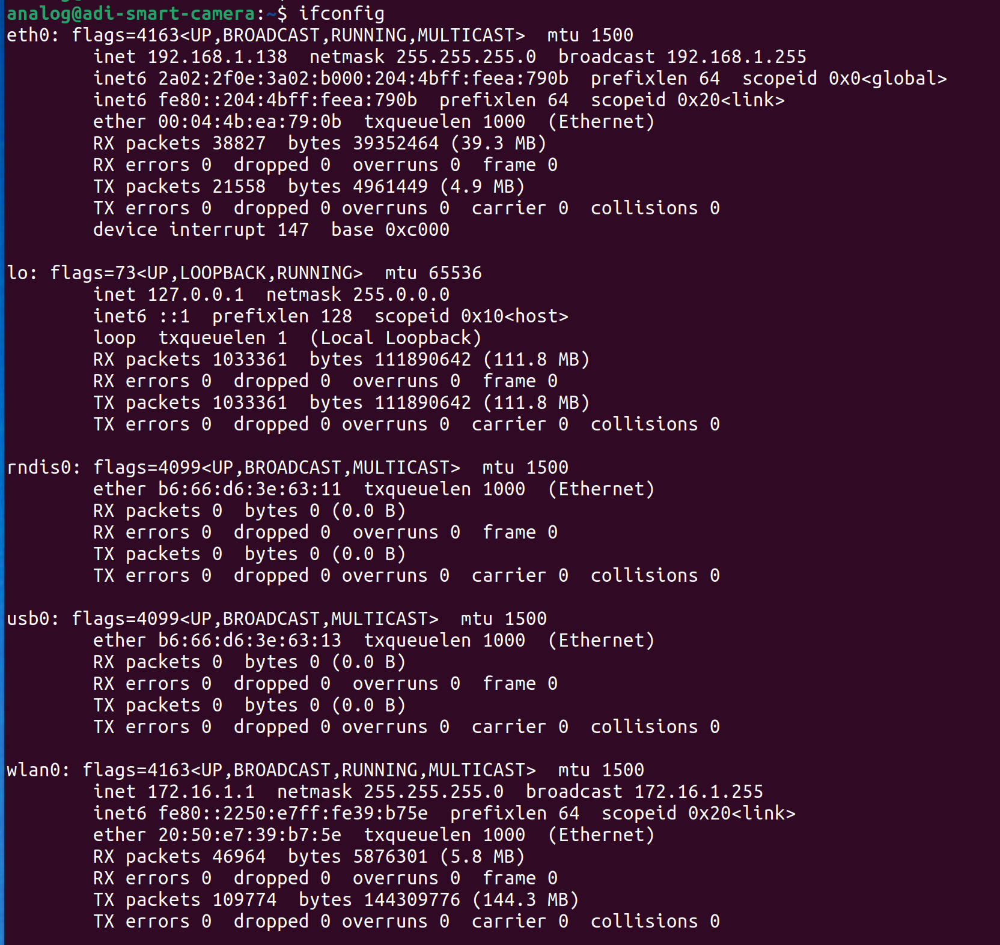
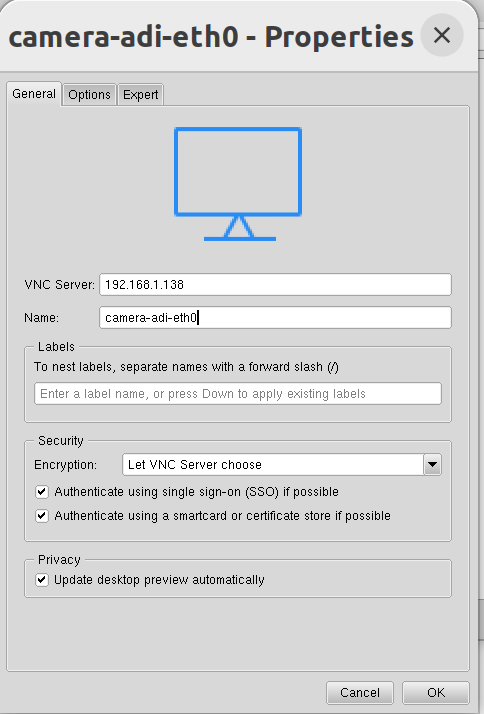
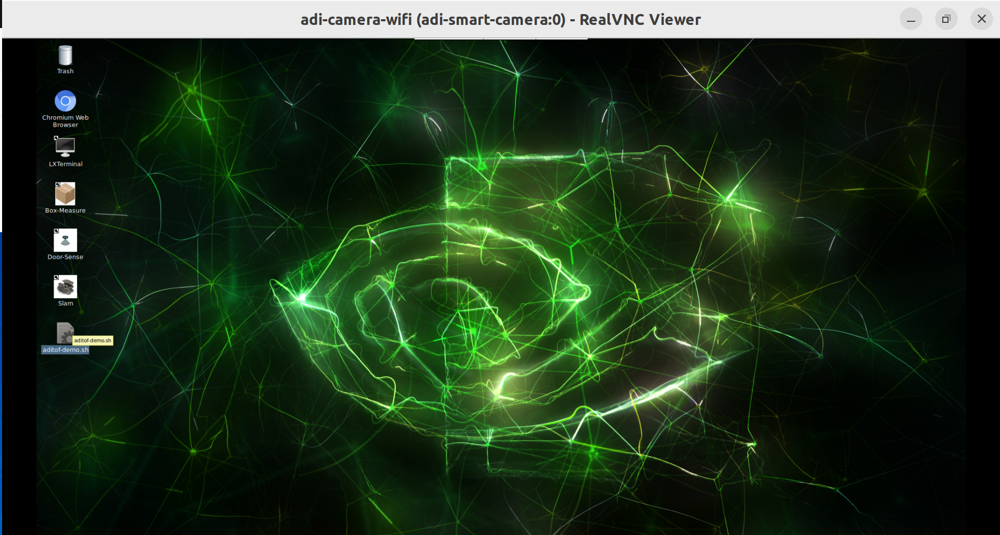
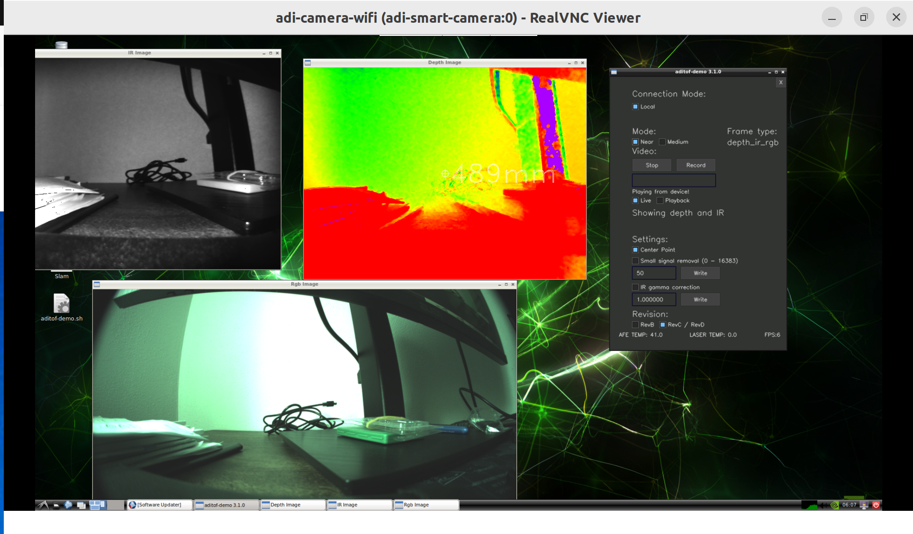
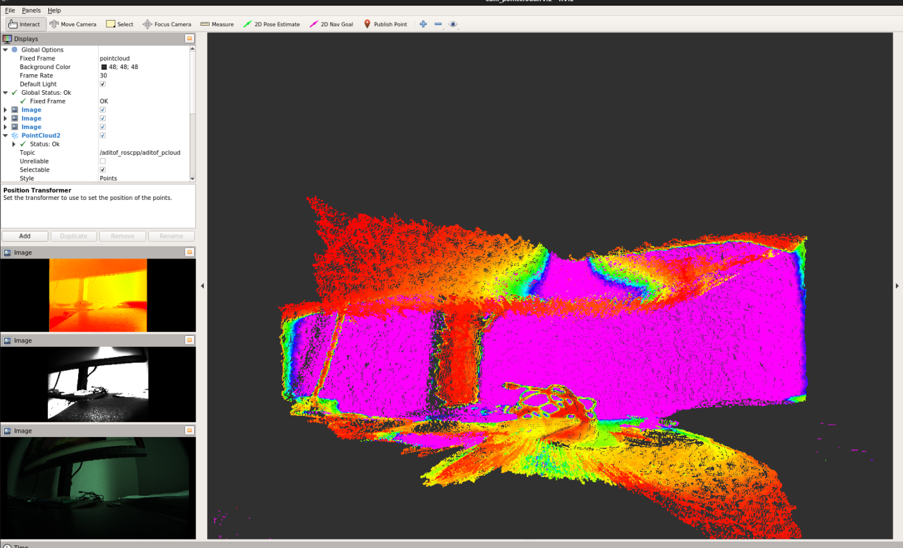
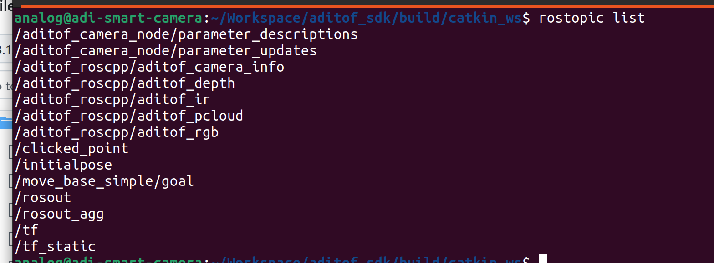

# Analog Devices 3D ToF software suite 

## Overview
The **ADI ToF SDK** is a cross platform library for the Analog Devices depth cameras based on the ADDI9036 TOF Signal Processor. It provides support for data processing on the embedded processor platform as well as for USB, Ethernet or Wi-Fi to connect to a host computer. This flexibility enables evaluation across a wide range of use cases and environments.

The SDK provides an API to control the ToF camera and stream data. Windows and Linux support are built into the SDK as well as sample code and wrappers for various languages including Python, C/C++ and Matlab.

License : [](https://github.com/analogdevicesinc/aditof_sdk/blob/master/LICENSE)

## Supported host platforms

For more details on building the SDK on a host platform please check the **User Guide** specified below for either Windows OS or Linux OS.

| Operating System | Documentation | GitHub master status | Downloads |
| --------- | ----------- | ----------- | ----------- |
| Windows | [User Guide](https://wiki.analog.com/resources/eval/user-guides/ad-96tof1-ebz/ug_windows) <br> [Build Instructions](doc/windows/build_instructions.md) | [](https://ci.appveyor.com/project/analogdevicesinc/aditof-sdk/branch/master) | [](https://github.com/analogdevicesinc/aditof_sdk/releases/latest) |
| Linux | [User Guide](https://wiki.analog.com/resources/eval/user-guides/ad-96tof1-ebz/ug_linux) <br> [Build Instructions](doc/linux/build_instructions.md) | [](https://dev.azure.com/AnalogDevices/3DToF/_build?view=runs&branchFilter=262) | [](https://github.com/analogdevicesinc/aditof_sdk/releases/latest) |

## Supported embedded platforms

Designed using a modular approach, the 3D ToF platforms enable connectivity to the to a variety of embedded processing platforms. For more details on running the SDK on your processing platform of choice please check the corresponding **User Guide** below.

### AD-3DSMARTCAM1-PRZ
Platform details : [](https://https://wiki.analog.com/resources/eval/user-guides/ad-3dsmartcam1-prz)

| Documentation | GitHub master status | Downloads |
| ------------- | ----------- | ----------- |
| [User Guide](https://wiki.analog.com/resources/eval/user-guides/ad-3dsmartcam1-prz?rev=1637140560#getting_your_system_up_and_running) <br> [Build Instructions](doc/3dsmartcam1/build_instructions.md) | [](https://dev.azure.com/AnalogDevices/3DToF/_build?view=runs&branchFilter=262) |  [](https://github.com/analogdevicesinc/aditof_sdk/releases/latest) 

#### Quick Setup

To get your AD-3DSMARTCAM1-PRZ camera up and running, follow these steps:

1. **Power Up**  
    Plug in the camera. The blue LED on the top right corner will light up, and the system will boot Linux OS (about 30 seconds).

2. **Connect to the Camera**  
    - **WiFi:**
        The camera exposes a WiFi AP named `ADI_Smart_Camera` (password: `ADI_Smart_Camera`). The camera's IP will be `172.16.1.1`.

        

        When the network is connected, you can connect to the camera over SSH. The password is `analog`:

        ```sh
        ssh analog@172.16.1.1
        ```

        

    - **Ethernet:**  
        Connect the camera to your local network using an Ethernet cable. The camera will obtain an IP address via DHCP. To find the assigned IP, first connect to the camera over WiFi, then run `ifconfig` and look for the `eth0` interface:

        

        Use SSH to connect to the camera using the Ethernet IP address (password: `analog`):

        ```sh
        ssh analog@<eth0_camera_ip>
        ```
        > **Note:** After connecting via Ethernet, you can disconnect from the `ADI_Smart_Camera` WiFi and use your local network for internet connectivity.

3. **Update the Software**  
    Ensure the camera is connected to the internet (preferably via Ethernet) and that the system date is correct. The camera uses the latest release of the Analog Devices ToF SDK (v3.1.0), available at [ADI ToF SDK v3.1.0](https://github.com/analogdevicesinc/aditof_sdk/tree/v3.1.0). 
    
    This demo uses a forked repository ([laurent-19/aditof_sdk](https://github.com/laurent-19/aditof_sdk/tree/v3.1.0)), with a configured remote named `laur_dev`.

    To list all configured git remotes, run:

    ```sh
    cd ~/Workspace/aditof_sdk
    git remote -v
    ```

    To update the software from the `laur_dev` remote, run:

    ```sh
    cd ~/Workspace/aditof_sdk
    git fetch laur_dev
    git pull laur_dev v3.1.0
    ```

    To update from the original ADI remote, run:

    ```sh
    cd ~/Workspace/aditof_sdk
    git checkout .
    git fetch origin
    git pull origin
    cd scripts/3dsmartcam1/
    ./sdk_update.sh
    ./apps_update.sh
    sudo reboot # password: analog
    ```

    For more details on the original system setup, see the [System Setup Guide](https://wiki.analog.com/resources/eval/user-guides/ad-3dsmartcam1-prz/ug_system_setup).


4. **Interact via VNC**  
    After rebooting, use VNC Viewer on your PC to connect to the camera. The Linux desktop will be displayed, providing shortcuts to demo and evaluation applications.

    - If you do not have VNC Viewer installed, download it from the [RealVNC website](https://www.realvnc.com/en/connect/download/viewer/linux). For Linux, you can use the `.deb` package.

    - Open VNC Viewer, select **File → New Connection**, and enter the camera's IP address (WiFi or Ethernet) as the host.

    Example VNC connection:

    
    

    Once connected, you will see the ADI Linux Desktop. Double-click the `aditof-demo.sh` shortcut to launch the demo application.

    

    The demo window will open with a 'Start' button. Click 'Start' to begin streaming depth, IR, and RGB video in separate windows, as shown below.

    

    To stop the streams, click the **Stop** button. To close the demo completely, press <kbd>Ctrl</kbd>+<kbd>C</kbd> in the terminal.

5. **Run the ROS application**

    This SDK uses **ROS1 Melodic**. For more information on building and running ROS1 packages, refer to the [ROS1 Tutorials](http://wiki.ros.org/ROS/Tutorials).

    The built ROS packages are located in the `build/catkin_ws` directory of your `aditof_sdk` workspace.

    ```sh
    cd ~/Workspace/aditof_sdk/build/catkin_ws
    ```

    Source the ROS environment and the workspace's `devel` setup script:

    ```sh
    source /opt/ros/melodic/setup.bash
    source devel/setup.bash
    ```

    > **Note:** You need to source `devel/setup.bash` every time you open a new SSH terminal connection.

    There are three launch files available:

    - **camera_node.launch**  
        Launches all camera nodes (depth, IR, RGB images, and point cloud), but does **not** start RViz automatically.

        ```sh
        roslaunch aditof_ros camera_node.launch
        ```
        To visualize the data, run RViz separately in another terminal:
        ```sh
        rosrun rviz rviz
        ```   
    - **rviz_publisher.launch**  
        Launches the camera nodes and starts RViz for visualizing point cloud data and the transform (`tf`) from `base_link` to the published point cloud.

        ```sh
        roslaunch aditof_roscpp rviz_publisher.launch
        ```

    - **cam_pcl_rviz.launch**  
        Launches the camera nodes (depth, IR, RGB images, point cloud, and `tf`) and starts RViz, allowing you to visualize all available data streams. Example visualization:

        

        ```sh
        roslaunch aditof_roscpp cam_pcl_rviz.launch
        ```

> **Note:** The `laur_dev` remote and forked repository ([laurent-19/aditof_sdk@v3.1.0](https://github.com/laurent-19/aditof_sdk/tree/v3.1.0)) include a bug fix for RGB image rendering in ROS/RViz. See the commit here: [analogdevicesinc/aditof_sdk@8807378](https://github.com/analogdevicesinc/aditof_sdk/commit/88073785902ccb1bc1a1978a54e5b9f50243a486).


You can work in the `build/catkin_ws` directory just like in any standard ROS1 workspace.

To view the topics published after launching a node, run:

```sh
rostopic list
```



To **build** the workspace, use:

```sh
cd ~/Workspace/aditof_sdk/build/catkin_ws
catkin_make
```
For more details on building and running the ROS nodes in the Aditof SDK, see the [ROS bindings documentation](https://github.com/analogdevicesinc/aditof_sdk/tree/main/bindings/ros).

> **Note:** For the original documentation and more detailed system-level information for the 3DSMARTCAM1 device, refer to the [AD-3DSMARTCAM1-PRZ User Guide](https://wiki.analog.com/resources/eval/user-guides/ad-3dsmartcam1-prz) and the [System Setup Guide](https://wiki.analog.com/resources/eval/user-guides/ad-3dsmartcam1-prz/ug_system_setup).

### AD-FXTOF1-EBZ
Platform details : [](https://wiki.analog.com/resources/eval/user-guides/ad-fxtof1-ebz)

| Platform | Documentation | GitHub master status | Downloads |
| --------- | ------------- | ----------- | ----------- |
| Raspberry Pi 3,4 | [User Guide](https://wiki.analog.com/resources/eval/user-guides/ad-fxtof1-ebz/ug_rpi) <br> [Build Instructions](doc/raspberrypi3/build_instructions.md) | [](https://dev.azure.com/AnalogDevices/3DToF/_build?view=runs&branchFilter=262) | [](https://swdownloads.analog.com/cse/aditof/raspberrypi-fxtof1-latest-image.tar.xz) <br> [](https://swdownloads.analog.com/cse/aditof/raspberrypi-fxtof1-latest-image-Sha256sum.txt) 
| Nvidia Jetson Nano | [User Guide](https://wiki.analog.com/resources/eval/user-guides/ad-fxtof1-ebz/ug_jetson) <br> [Build Instructions](doc/jetson/build_instructions.md) | [](https://dev.azure.com/AnalogDevices/3DToF/_build?view=runs&branchFilter=262) | [](http://swdownloads.analog.com/cse/aditof/jetson_nano-fxtof1-latest-image.tar.xz) <br> [](http://swdownloads.analog.com/cse/aditof/jetson_nano-fxtof1-latest-image-Sha256sum.txt) 
| Nvidia Jetson Xavier NX | [User Guide](https://wiki.analog.com/resources/eval/user-guides/ad-fxtof1-ebz/ug_xavier_nx) <br> [Build Instructions](doc/xavier-nx/build_instructions.md) | [](https://dev.azure.com/AnalogDevices/3DToF/_build?view=runs&branchFilter=262) | [](http://swdownloads.analog.com/cse/aditof/xavier_nx-fxtof1-latest-image.tar.xz) <br> [](http://swdownloads.analog.com/cse/aditof/xavier_nx-fxtof1-latest-image-sha256.txt)

### AD-96TOF1-EBZ
Platform details : [](https://wiki.analog.com/resources/eval/user-guides/ad-96tof1-ebz)

| Platform | Documentation | GitHub master status | Downloads |
| --------- | ------------- | ----------- | ----------- |
| DragonBoard 410c | [User Guide](https://wiki.analog.com/resources/eval/user-guides/ad-96tof1-ebz/ug_db410c) <br> [Build Instructions](doc/dragonboard410c/build_instructions.md) | [](https://dev.azure.com/AnalogDevices/3DToF/_build?view=runs&branchFilter=262) | [](http://swdownloads.analog.com/cse/aditof/dragonboard410c-latest-image.tar.xz) <br> [](http://swdownloads.analog.com/cse/aditof/dragonboard410c-latest-image-Sha256sum.txt) |
| Raspberry Pi 3,4 | [User Guide](https://wiki.analog.com/resources/eval/user-guides/ad-96tof1-ebz/ug_rpi) <br> [Build Instructions](doc/raspberrypi3/build_instructions.md) | [](https://dev.azure.com/AnalogDevices/3DToF/_build?view=runs&branchFilter=262) | [](http://swdownloads.analog.com/cse/aditof/raspberrypi-latest-image.tar.xz) <br> [](http://swdownloads.analog.com/cse/aditof/raspberrypi-latest-image-Sha256sum.txt) 
| Nvidia Jetson Nano | [User Guide](https://wiki.analog.com/resources/eval/user-guides/ad-96tof1-ebz/ug_jetson) <br> [Build Instructions](doc/jetson/build_instructions.md) | [](https://dev.azure.com/AnalogDevices/3DToF/_build?view=runs&branchFilter=262) | [](http://swdownloads.analog.com/cse/aditof/jetson_nano-latest-image.tar.xz) <br> [](http://swdownloads.analog.com/cse/aditof/jetson_nano-latest-image-Sha256sum.txt) 
| Nvidia Jetson Xavier NX | [User Guide](https://wiki.analog.com/resources/eval/user-guides/ad-96tof1-ebz/ug_xavier_nx) <br> [Build Instructions](doc/xavier-nx/build_instructions.md) | [](https://dev.azure.com/AnalogDevices/3DToF/_build?view=runs&branchFilter=262) | [](http://swdownloads.analog.com/cse/aditof/jetson_xavier_nx-latest-image.tar.xz) <br> [](http://swdownloads.analog.com/cse/aditof/jetson_xavier_nx-latest-image-Sha256sum.txt) 
| Nvidia Jetson Xavier AGX | [User Guide](https://wiki.analog.com/resources/eval/user-guides/ad-96tof1-ebz/ug_xavier_agx) <br> [Build Instructions](doc/xavier-agx/build_instructions.md) | [](https://dev.azure.com/AnalogDevices/3DToF/_build?view=runs&branchFilter=262) | [](http://swdownloads.analog.com/cse/aditof/jetson_xavier_agx-latest-image.tar.xz) <br> [](http://swdownloads.analog.com/cse/aditof/jetson_xavier_agx-latest-image-Sha256sum.txt) 
| Thor96 | [Arrow Electronics Github](https://github.com/ArrowElectronics/aditof_sdk#supported-embedded-platforms) | - | - |

[How to write the SD card image onto the SD card?](doc/sdcard_burn.md)

## SDK documentation

From an architectural point of view, the SDK consists of two layers. One layer is the high level API which allows to easily create a camera object, configure it and request frames. The other layer is the low level API which exposes an interface through which advanced configuration operations can be executed on the camera hardware.

For more details about the SDK check the links below:

[Software stack documentation](https://github.com/analogdevicesinc/aditof_sdk/blob/master/sdk/readme.md)

[Camera details documentation](https://github.com/analogdevicesinc/aditof_sdk/blob/master/sdk/src/cameras/readme.md)

[API Doxygen documentation](https://analogdevicesinc.github.io/aditof_sdk/)

[Building and installing the SDK](https://github.com/analogdevicesinc/aditof_sdk/tree/master/cmake/)

## SDK examples
| Example | Language | Description |
| --------- | ------------- | ----------- |
| aditof-demo | <a href="https://github.com/analogdevicesinc/aditof_sdk/tree/master/examples/aditof-demo"> C++ </a> | An application that displays the infrared and depth images. |
| first-frame | <a href="https://github.com/analogdevicesinc/aditof_sdk/tree/master/examples/first-frame"> C++ </a> <br> <a href="https://github.com/analogdevicesinc/aditof_sdk/tree/master/bindings/python/examples/first_frame"> Python </a> | An example code that shows the steps required to get to the point where camera frames can be captured. |
| first-frame-network | <a href="https://github.com/analogdevicesinc/aditof_sdk/tree/master/examples/first-frame-network"> C++ </a> | An application that shows how to use the aditof sdk to talk to a remote ToF camera over the network. |
| low_level_example | <a href="https://github.com/analogdevicesinc/aditof_sdk/tree/master/bindings/python/examples/low_level_example"> Python</a> | A simple example of how to get access to the low-level API of the camera. |
| dnn | <a href="https://github.com/analogdevicesinc/aditof_sdk/tree/master/bindings/python/examples/dnn"> Python with OpenCV</a> <br> <a href="https://github.com/analogdevicesinc/aditof_sdk/tree/master/bindings/opencv/dnn"> C++ with OpenCV </a> | A simple object detection example. |
| imshow | <a href="https://github.com/analogdevicesinc/aditof_sdk/tree/master/bindings/opencv/imshow"> C++ with OpenCV </a> | A basic example that displays data provided by the Aditof SDK. |
| Image Acquisition Toolbox | <a href="https://github.com/analogdevicesinc/aditof_sdk/tree/master/bindings/matlab"> MATLAB </a> | Examples of how to use the AD-96TOF1-EBZ camera in MATLAB over USB and Network. |
| Hand Gesture Detection | <a href="https://github.com/mathworks/MATLAB-Demo-ADI-ToF"> MATLAB </a> | Detecting hand signs to play Rock, Paper and Scissors. |
| showPointCloud | <a href="https://github.com/analogdevicesinc/aditof_sdk/tree/master/bindings/python/examples/showPointCloud"> Python with Open3D </a> <br> <a href="https://github.com/analogdevicesinc/aditof_sdk/tree/master/bindings/open3D/showPointCloud"> C++ with Open3D </a> | A basic example that displays a pointcloud built using the Open3D library and the data provided by the Aditof SDK. |
| showPointCloud <br> camera node | <a href="https://github.com/analogdevicesinc/aditof_sdk/tree/master/bindings/ros"> C++ with ROS </a> | A simple example of how to use AD-96TOF1-EBZ with the ROS distribution. |

## Directory Structure
| Directory | Description |
| --------- | ----------- |
| apps | Applications specific to various targets and hosts |
| bindings | SDK bindings to other languages |
| ci | Useful scripts for continuous integration |
| doc | Documentation |
| examples | Example code for the supported programming languages |
| misc | Calibration and kernel files |
| scripts | Useful development scripts |
| sdk | SDK source code |
| tools | Camera calibration tools |
| utils | Various utils for the embedded platforms |

## Contributing to the SDK

### Formating

The SDK is formated using <a href="https://packages.ubuntu.com/search?keywords=clang-format-6.0">clang-format 6.0</a>.

Before creating a PR please run `./scrips/format.sh` from the root of the project.

In order to prevent a file from being formated add it to `.clangformatignore`
